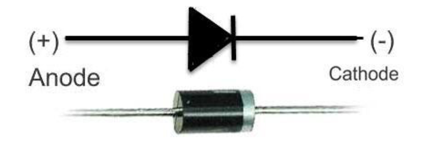
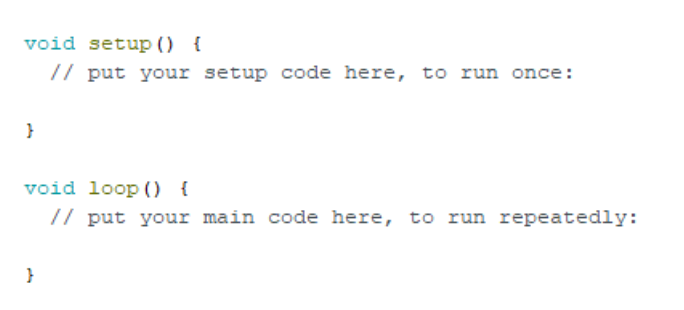
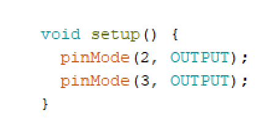
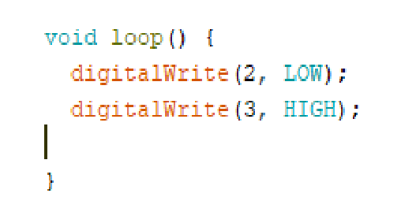

# Първо Занятие или Какво е диод и как да го светем с Ардуино

## Как работят диодите?
* Диодите са полярен елемент, тоест те имат + плюс и             - минус . Функцията, която те изпълняват е да пропускат ток само в една посока, а именно от + към -. Те работят като клапа и много често диодите се използват само, за да предпазват другите елементи от случайно протекъл ток в обратната посока.

* Един от начините, по който може да разберем кой е плюсът на диодите, е като погледнем краката им. Минусът е с малко по-къс крак.

## Светодиоди

*  Светодиодите имат същите характеристики като обикновените диоди, но с ключовата разлика, че излъчват светлина. В Drako имаме такъв който сега ще светнем.

## Програмиране на диодите

* Ще продължим като зададем на диодите да светнат с помощта на Arduino микроконтролера. Това е сравнително лесна програма и често се използва като основа в програмирането на Arduino.
Нека да научим как става. Когато заредим програмата за  пръв път ще види следния код:

* Още в началото виждаме двете основни части на кода, а именно **void setup** и **void loop**.
Важно е да запомним, че всичко, което запишем в **setup**  ще се изпълни само веднъж. Това е и причината в него главно да дефинираме пиновете на Arduino  микроконтролера. Тук идва и въпросът, какво е дефиниране на пинове?

## **void setup** и дефиниране на пинове

* Всеки един от пиновете може да е **INPUT** или **OUTPUT**.
Ако зададем на един пин да бъде **INPUT**, то от него се очаква да получим информация, тоест микроконтролера да получи някакъв вид информация. В ежедневието това са неща като клавиатури, мишки, микрофон и други сензори.
Ако зададем на един пин да бъде **OUTPUT**, то от него се очаква да дадем информация, тоест микроконтролера изпраща някаква информация до нас. За пример можем да дадем слушалки, мотори, диоди и други.
Ние използваме диоди, от тях няма каква информация да дадем на микроконтролера, затова единственото, за което можем да ги използваме е да им подадем ток  и ще бъдат **OUTPUT**.

* Чрез кода можем да зададем на Arduino микроконтролера, че диодите ни са **OUTPUT** като използваме командата **pinMode**.
С това сме приключили дефинирането на пиновете и съответно с **void setup**.

## void loop

* Кодът, написан в **void loop** ще се изпълнява без да спира. Това означава, че там ще искаме да пишем същинският код, с който задаваме на робота да извършва различни команди. Ще използваме нова команда – **digitalWrite**. Тази команда се използва, за да подава ток на съответен пин и може да приеме само две състояния **LOW** или **HIGH**. При **LOW** не се подава никакъв ток към съответния пин, а при **HIGH** ще се подава 5 волта към съответния пин. От сглобяването сме научили, че диодите са свързани към пинове 2 и 3. Съответно пин 2 за минус или **GND**, а пин 3 за плюс.Първото число в **digitalWrite** ще отговаря на избрания

* пин, а второто за състоянието – **LOW** или **HIGH**.
След като вече знаем, че пин 2  е минус, следователно не искаме да подаваме ток към него и затова записваме **LOW**, а защото пин 3 е плюс ще искаме да подадем и използваме **HIGH**.
Когато качим програмата на Arduino микроконтролера можем да видим, че диодите светят.
